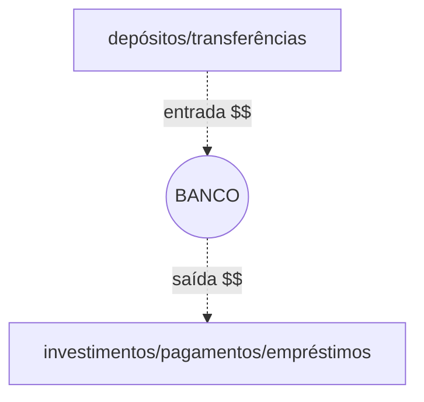
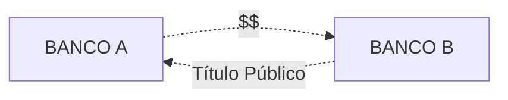
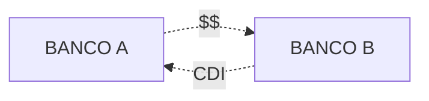

##O que é o mercado interbancário?

Durante um dia, acontece um grande fluxo de dinheiro em um banco.

O dinheiro pode sair das contas do banco na forma de empréstimos, investimentos, pagamentos e transferências e entrar como depósitos, transferências etc.

Figura 1 - Fluxo de dinheiro em um banco.

Em um sistema de [reservas fracionárias](/aprenda/financas/economia/sistema-bancario), como é o sistema bancário brasileiro, os bancos mantém em sua posse apenas uma fração do dinheiro total que movimentam.

Isso gera uma situação em que os bancos ficam alavancados, isto é, devem mais do que realmente possuem.

O Banco Central do Brasil (BACEN) é quem determina quanto cada banco deve manter guardado. Esse dinheiro deve ficar depositado em uma conta que o banco tem no Banco Central, e é chamado de **depósito compulsório**.

A quantidade prevista de depósito compulsório que um banco deve possuir é calculada ao final do dia, contabilizando-se todas as operações que o banco fez ao longo do dia.

É comum que alguns bancos se encontrem em situação onde:

- Estão com valores menores do que o previsto nas suas contas no BACEN; ou
- Estão com valores acima do previsto nas suas contas no BACEN.

Para evitar ter de pegar dinheiro emprestado com o governo (que cobra juros altos) ou ficar com dinheiro sobrando sem rendimento, os bancos emprestam dinheiro entre si. Bancos que possuem reservas em excesso emprestam dinheiro para aqueles que precisam de dinheiro.

Se esses empréstimos forem realizados com títulos públicos sendo oferecidos como garantia, por lei, eles devem ser pagos no dia seguinte. Assim, o banco fica com o dinheiro emprestado apenas de um dia para o outro, o que caracteriza a denominação ***overnight*** — que traduzido do inglês seria algo como "durante a noite" — dada a esse tipo de empréstimo.

Esse ambiente de negociação entre bancos é chamado de **mercado interbancário**.

##Sistema Especial de Liquidação e Custódia (SELIC)

Parte dos empréstimos realizados pelos bancos no mercado interbancário se dá utilizando titulos de dívida pública como garantia.

Figura 2 - Estrutura básica de um empréstimo interbancário no SELIC.

Esses empréstimos são registrados em um sistema eletrônico chamado Sistema Especial de Liquidação e Custódia (SELIC).

A taxa média dos empréstimos realizados no SELIC é a chamada [taxa SELIC](/aprenda/financas/economia/taxa-selic).

A esse ambiente de negociaçao de títulos públicos entre as instituições financeiras se dá o nome de ***open market***.

##Certificado de Depósito Interbancário (CDI)

###O que é o Certificado de Depósito Interbancário?

Por vezes, os bancos precisando de dinheiro podem não ter a sua disposíção títulos públicos para oferecer como garantia, ou podem precisar realizar o empréstimo por mais de um dia.

Nesse caso, o banco emite um título, chamado de Certificado de Depósito Interbancário (CDI), onde especifica as características do empréstimo.

Na realidade, um banco que empresta dinheiro a outro banco comprará um CDI.

Figura 3 - Estrutura de um empréstimo interbancário fora do SELIC.

Os CDI também são chamados de **depósitos interfinanceiros (DI)**.

###O que é a taxa DI?

A taxa média dos juros cobrados nos empréstimos que os bancos fazem no mercado interbancário emitindo CDI é chamada de **taxa DI**, ou **taxa de depósitos interfinanceiros**.

Esses empréstimos podem ter duração de um dia ou mais. Quando refere-se somente aos empréstimos com duração de um dia, chama-se a taxa de ***DI over*** (em referência ao termo *overnight*).

Para saber como a taxa é calculada, de uma olhada na [metodologia oficial](http://www.b3.com.br/pt_br/market-data-e-indices/indices/indices-de-segmentos-e-setoriais/metodologia-do-di.htm).

###O que é a taxa CDI?

É apenas um outro nome para a taxa DI.

###Para que serve a taxa DI?

A grande maioria dos bancos costuma oferecer investimentos de renda fixa que são remunerados pela taxa DI.

Assim, é um índice de referência para investimentos de renda fixa.

###Qual o rendimento do CDI?

A taxa DI é calculada fazendo-se uma média de todos os empréstimos realizados em um dia no sistema interbancário. Normalmente, ela é divulgada em valores anuais, fazendo-se a conversão de taxas.

A instituição que realiza o cálculo do DI e divulga ao mercado é a B3. Você pode conhecer os valores divulgados do DI/CDI acessando o [*site*](http://www.b3.com.br/pt_br/market-data-e-indices/indices/indices-de-segmentos-e-setoriais/serie-historica-do-di.htm) da B3. 

##CDI e SELIC

O **risco soberano**, isto é, o risco de o governo dar calote nas suas dívidas, é considerado menor do que o **risco privado** — risco das empresas e instituições privadas não pagarem suas dívidas. Assim, teoricamente, emprestar dinheiro ao governo deveria ser o o investimento com o menor rendimento, haja vista ter o menor risco.

Considerando-se a taxa SELIC (risco soberano) e a taxa DI (risco privado), era de se esperar que a taxa DI fosse maior que a taxa SELIC. No entanto, a taxa DI costuma ser **igual ou inferior à taxa SELIC**. 

Esse comportamento inesperado pode ser explicado por algumas razões como:

- Os bancos são remunerados pela taxa SELIC mas remuneram seus clientes pela taxa DI, havendo um interesse deles de manter o DI mais baixo;
- A metodologia de cálculo da taxa DI diz que, caso algumas condições não sejam atingidas, a taxa DI do dia será igual a taxa SELIC divulgada para o mesmo dia.

Assim, se compararmos ambas as taxas ao longo do tempo, veremos que elas tem uma tendência de manter-se igual ou com a taxa DI abaixo da taxa SELIC.

| Data   | Taxa DI Média | Taxa SELIC |
|--------|---------------|------------|
| jan-18 | 6,89          | 6,9        |
| fev-18 | 6,89          | 6,9        |
| mar-18 | 6,64          | 6,65       |
| abr-18 | 6,39          | 6,4        |
| mai-18 | 6,39          | 6,4        |
| jun-18 | 6,39          | 6,4        |
| jul-18 | 6,39          | 6,4        |
| ago-18 | 6,39          | 6,4        |
| set-18 | 6,39          | 6,4        |
| out-18 | 6,4           | 6,4        |
| nov-18 | 6,4           | 6,4        |
| dez-18 | 6,4           | 6,4        |

Figura 4 - Taxa DI Média e Taxa Selic no ano de 2018.

##DI Futuro

Já que a taxa SELIC não é a taxa considerada como referência de menor risco pelo mercado, qual seria essa taxa?

A resposta é: **a taxa do contrato futuro de DI de 1 dia**.

O contrato futuro funciona basicamente assim:

- Há  uma data de vencimento; e
- Há um preço (que no caso do DI futuro é dado em taxa de juros).

No contrato futuro do DI de 1 dia (ou *DI-over*) negocia-se a taxa do DI de 1 dia convertida para valores anuais.

Assim, digamos que no dia 04/09/2019, o contrato futuro com vencimento em 01/10/2019 estava sendo negociado a uma taxa de 5,73%. Isto significa que os investidores desse contrato esperam que, pelos próximos 26 dias corridos, as taxas praticadas nos negócios interbancários de *overnight* sejam equivalentes à 5,73% ao ano.

Assim, um investidor que quisesse encontrar um investimento também com vencimento em 01/10/2019, exigiria um prêmio sobre essa taxa de 5,73% como forma de recompensar seu risco, já que a taxa do DI futuro é a referência de menor risco.

Outra maneira de se referir a taxa de menor risco é pela expressão **custo de oportunidade**.

Se um investidor pode deixar seu dinheiro rendendo pela taxa DI a um risco considerado mínimo, qualquer outro investimento que ele faça terá de compensá-lo por não ter investido no DI, perdendo a **oportunidade** de auferir rendimentos pela taxa DI a um risco reduzido.

$$

Rendimento\,Esperado = Custo\,de\,Oportunidade + Prêmio\,de\,Risco

$$

Fórmula  1 - O rendimento esperado para um investimento consiste em um prêmio de risco acrescido à taxa de rendimento mais segura, chamada de custo de oportunidade.

Quando vão analisar o preço de um ativo, os investidores analisam qual é o seu custo de oportunidade, isto é, o valor que receberiam aplicando no investimento de menor risco (taxa do DI futuro), e adicionam um prêmio que consideram adequado para compensar o risco a que estarão expostos investindo neste ativo.

**Referências**:

FORTUNA, Eduardo. <strong>Mercado Financeiro: produtos e serviço</strong>. 18 ed. Rio de Janeiro. Qualitymark, 2010.

ROQUE, Leandro. <strong>A taxa SELIC - o que é, como funciona e outras considerações</strong>. IMB, 2009. Disponível em <a href="https://www.mises.org.br/Article.aspx?id=344">https://www.mises.org.br/Article.aspx?id=344</a> 

FIGUEIREDO, Jefferson <strong>Qual a diferença entre a taxa CDI e Selic?</strong>. Blog Renda Fixa na Prática, 2018. Disponível em <a href="https://rendafixapratica.com.br/qual-a-diferenca-entre-a-taxa-cdi-e-selic/">https://rendafixapratica.com.br/qual-a-diferenca-entre-a-taxa-cdi-e-selic/</a> 
\

