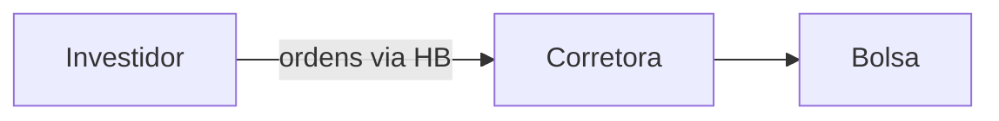

##O que é o *homebroker*?

**O *homebroker* é um programa de computador** oferecido pela sua Corretora de Valores que lhe permite acessar o sistema de negociação da Bolsa de Valores e efetuar compras, vendas e outras operações.

As Corretoras de Valores funcionam como intermediários entre você e o sistema da Bolsa de Valores.

Antigamente, os corretores trabalhavam dentro da bolsa e os negócios eram feitos na base do grito, gestos e empurra-empurra. Para poder comprar ou vender uma ação, você teria que ligar para o corretor e perguntar para ele por quais preços as ações estavam sendo negociadas.

Com o avanço da informática e o surgimento da internet, o sistema foi todo automatizado. Hoje em dia todas as informações aparecem na tela do seu computador e por ali mesmo você envia as ordens pelo preço que quiser. Isto tornou o investimento em ações e outros ativos negociados na Bolsa de Valores extremamente simples e acessível.

Você utiliza o *homebroker* no seu computador pessoal, direto no navegador, bastando estar conectado à internet.

A evolução tecnológica também trouxe uma grande quantidade de novas funções e operações ao sistema, por isso, para o iniciante, o primeiro contato com o *homebroker* pode ser um pouco assustador. Este guia pretende lhe introduzir as principais funções e operações que são oferecidas na maioria dos *homebroker*s das Corretoras de Valores brasileiras.

## Como instalar o *homebroker*?

Não é necessário instalar nenhum programa. O *homebroker* pode ser acessado direto pelo *site* da sua Corretora de Valores.

Existem alguns *homebroker*s que podem ser instalados como plataforma *desktop* (instalados no seu computador) e normalmente oferecem opções mais avançadas que não são essenciais ao investidor comum.

##O que eu posso fazer no *homebroker*?

As funcionalidades básicas de qualquer *homebroker* são:

- Acompanhar o preço e as ofertas registrdas no sistema;
- Gráficos de preços ao longo do tempo;
- Verificar o saldo de sua conta corrente;
- Verificar quais ativos você possui em sua conta de custódia;
- Enviar ordens de compra e venda; e
- Acompanhar o andamento das suas ordens.

Existem opções que dependem da disponibilidade oferecida pela sua corretora. Quanto mais coisas você puder fazer pelo *homebroker*, melhor, pois você não precisará ficar ligando ou dependendo do operador da corretora para fazer o que quer.

 Algumas opções extrar que você pode encontrar são:

- Indicadores gráficos é técnicos;
- Operações com derivativos;
- Ordens automatizadas; e
- Aluguel de ações.

##*Layout*

Ao abrir o seu *homebroker* você poderá se deparar com algo semelhante à imagem abaixo:

Todos os *homebroker*s costumam apresentar as mesmas informações básicas que são mostradas em áreas que subdividem a janela principal. São elas:

- Cesta de Ordens;
- Informações do seu saldo;
- Carteira de ações;
- Boleta de ordens;
- Livro de ofertas;
- Gráfico; e
- Custódia.

É possível mudar o tamanho e as informações que você deseja mostrar, personalizando seu *homebroker*. Pode ser também que o layout do *homebroker* da sua corretora seja um pouco diferente, mas, no geral, as informações mostradas serão as mesmas. Lembre-se que o *homebroker* é apenas um programa de computador como qualquer outro.

###Cesta de Ordens

A cesta de ordens é a parte do *homebroker* em que você poderá ver os detalhes de todas as ordens que enviou. Você pode também verificar a situação das suas ordens ou cancelar orden que enviou e deseja retirar ou mudar.

A sua ordem pode estar nas seguintes situações:

- **Aprovada pela bolsa**: sua ordem foi enviada e está ok;
- **Cancelada**: sua ordem foi cancelada por ter sido enviada errada ou porque você solicitou o cancelamento;
- **Executada**: sua ordem foi completamente executada; e
- **Parcialmente executada**: apenas uma parte de sua ordem foi executada, a ordem ainda permanece até o restante ser executado.

###Informações de Saldo

Indicam o quanto de dinheiro você tem disponível na conta da corretora para poder fazer suas operações de compra.

###Carteira de Ações

A carteira de ações é uma forma rápida de visualizar diversas informações sobre as ações ou ativos em que você está interessado. Basta digitar o código da ação e você terá acesso a:

- Valor do último negócio;
- Variação no dia;
- Melhor oferta de compra (preço e quantidade);
- Melhor oferta de venda (preço e quantidade);
- Preço de abertura;
- Preço médio;
- Preço máximo do dia;
- Preço mínimo do dia;
- Quantidade de negócios; e
- Volume.

###Boleta de Ordens

A boleta de ordens é um formulário que você deve preencher com as informações da compra ou venda que deseja fazer.

###Livro de Ofertas (*Book*)

O livro de ofertas mostra quais ordens estão no sistema da Bolsa de Valores para uma determinada ação. Ao digitar o código da ação você verá:

- Ordens de compra e venda enviadas e ainda não executadas;
- Qual corretora enviou a ordem;
- Qual a quantidade de ações está sendo oferecida para compra/venda (1K = 1.000 ações); e
- Qual o preço oferecido por ação.

###Gráfico

O gráfico demonstra de forma visual a variação dos preços ao longo dos dias.

###Custódia

A custódia é onde você vê quais ativos você possui e em que quantidade. Outras informações como preço atual também podem estar disponíveis.