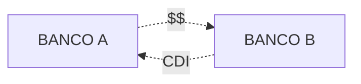

## O que é CDI?

CDI é a sigla para Certificado de Depósito Interfinanceiro também comumente chamado de Certificado de Depósito Interbancário.

O CDI é um título utilizado pelos bancos no [mercado interbancário](/aprenda/financas/economia/mercado-interbancario) para fazer empréstimos.

## O mercado Interbancário

Diariamente, os bancos devem manter uma certa quantidade de dinheiro junto ao Banco Central, chamada de [depósito compulsório](/aprenda/financas/economia/politica-monetaria#depósito-compulsório).

É comum que, devido às operações que realizaram durante o dia, alguns bancos terminem com menos dinheiro do que necessitam enquanto outros terminem com sobra de recursos.

Os bancos que tem sobrando emprestam dinheiro para os que estão precisando. Isso pode ser feito:

- Utilizando títulos públicos como garantia; ou
- Utilizando os CDI.

Os CDI são utilizados quando o banco não possui títulos públicos ou quando o empréstimo precisa seguir padrões diferentes dos especificados no [SELIC](/aprenda/financas/economia/taxa-selic).

Figura 1 - Estrutura de um empréstimo interbancário fora do SELIC.

## Taxa DI

Nos empréstimos feito no mercado interbancário utilizando-se os CDI, são cobrados juros.

A média dos juros apurados nestes empréstimos é chamada de [taxa DI](/enciclopedia/termos/t/taxa-di).

É comum que haja referências a taxa DI utilizandos o termo CDI.

Assim, quando você ouvir que algum investimento é remunerado pelo CDI, na verdade trata-se da taxa DI.