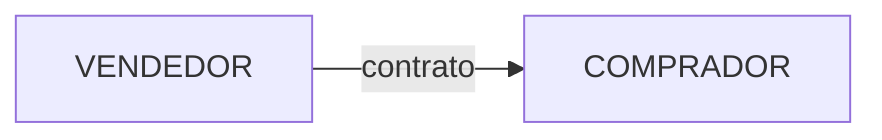
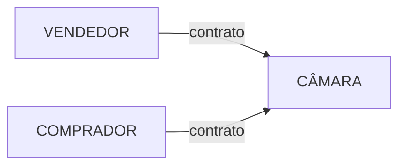

## O que é um contrato futuro?

Um contrato futuro é um acordo firmado entre duas partes para negociar alguma coisa em uma data futura especificada e a um preço predeterminado.

Contratos futuros são chamados de [derivativos](/enciclopedia/termos/d/derivativo) pois o preço do contrato deriva do preço de outro ativo (ativo subjacente).

Contratos futuros são negociados de forma padronizada, tendo previamente especificados:

- Quantidade;
- Qualidade;
- Prazo de liquidação; e
- Forma de cotação do ativo-objeto sobre os quais se efetuam as negociações.

Esse tipo de padronização facilita a negociação e a análise dos ativos pelos investidores.

## Funcionamento

Um contrato futuro é um acordo entre um comprador (ou vendedor) e uma Bolsa ou Câmara de Compensação em que o comprador (vendedor) concorda em receber (entregar) algo a um preço predeterminado na data especificada.

- O preço pelo qual as partes combinaram fazer a transação é chamado de **preço futuro**; e
- A data especificada para concretizar a transação é chamada de **data de liquidação**.

Por exemplo:

Existe na B3 um contrato futuro para negociação de soja.

O ativo negociado é a saca de 60kg de soja. Cada contrato envolve uma transação de 450 sacas (27 toneladas) de soja.

Digamos que eu compre um desses contratos com prazo de vencimento para o mês seguinte por um preço de liquidação de US\$100,00 por saca.

Digamos também que você venda um contrato com prazo de vencimento para o mês seguinte por um preço de liquidação de US\$100,00 por saca.

No dia do vencimento do contrato, você me entregará 450 sacas de soje e eu lhe entregarei US\$45.000,00 (\$100,00 x 450).

## Tipo de Liquidação

A liquidação do contrato pode ser:

- **Financeira**: efetuada somente em dinheiro; ou
- **Física**: ocorre a efetiva transação da mercadoria entre as partes.

Atualmente, a grande maioria dos contratos tem liquidação financeira.

### Liquidação Financeira

A liquidação financeira ocorre através do pagamento em dinheiro.

Por exemplo, se eu comprei um contrato futuro de soja a um preço futuro de US\$100,00 e, no dia do vencimento a saca está US\$110,00, isso significa que eu poderia comprar uma saca por US\$100,00 exercendo o contrato e revendê-la por US\$110,00, obtendo um lucro de US\$10,00 por saca.

Por outro lado, se a saca da soja estivesse US\$90,00, eu teria um prejuízo de US\$10,00 por saca.

Em contrato de liquidação financeira, utiliza-se esse raciocínio para calcular o valor de liquidação do contrato, sem que seja necessário transicionar o ativo físico, no caso, a saca de soja.

Assim, se no vencimento do contrato o preço da saca for:

- **US\$110,00**: eu receberei US\$10,00 por saca. Como o contrato é de 450 sacas, receberei US\$4.500,00; e
- **US\$90,00**: eu terei de pagar US\$10,00 por saca. Como o contrato é de 450 sacas, pagarei US\$4.500,00.

### Liquidação Física

A liquidaçaõ física é mais intuitiva de se entender.

Nesse caso, no vencimento do contrato, o vendedor entrega o produto (sacas de soja) ao comprador do contrato e o comprador entrega o dinheiro ao vendedor, efetuando a efetiva transação do produto.

A Bolsa possui locais padronizados para que essas transações ocorram, além de especificar padrões de qualidade para o produto.

Observe, por exemplo as características exigidas para a soja:

Soja em grão a granel tipo exportação, com os seguintes limites máximos: 14% (catorze por cento) de umidade; 1% (um por cento)de matérias estranhas e impurezas; 30% (trinta por cento) de quebrados; 8% (oito por cento) de esverdeados; 8% (oito por cento) de avariados (queimados, ardidos, mofados, fermentados, germinados, danificados, imaturos e chochos), dos quais se permite até 6% (seis por cento) de grãos mofados, até 4% (quatro por cento) de grãos ardidos e queimados, sendo que esse último não pode ultrapassar 1% (um por cento); e 18,5% de conteúdo de óleo.

Figura 1: Especificação do ativo-objeto do contrato futuro de soja. Fonte: B3.

O curioso desse tipo de liquidação é que um investidor desatento que compre um contrato de liquidação física e permaneça com ele até o vencimento pode acabar se vendo possuidor de 450 sacas de 60kg de soja.

## Para que serve um contrato futuro?

Contratos futuros são úteis para evitar exposição às variações de preço do ativo subjacente.

Por exemplo, digamos que eu seja dono de uma indústria cuja matéria prima seja a soja. 

Se o preço da soja subir em demasia, minhas margens de lucros podem se reduzir drasticamente, colocando meu negócio em dificuldades financeiras.

Comprando um contrato futuro que estabelece um preço a ser pago pela soja no futuro eu garanto que, se o preço da soja subir, eu não terei prejuízo.

Por outro lado, se o preço da soja cair, não aproveitarei essa queda por ter de pagar mais caro na liquidação do contrato.

O raciocínio inverso funciona para o vendedor da soja.

Se o preço da soja cair no mercado e ficar abaixo dos custos de produção, o produtor terá prejuízo.

Vendendo um contrato futuro, ele trava o preço de venda da soja e pode garantir que terá lucro na sua produção.

## Margem

Para investir em contratos futuros não é preciso ter disponível todo o valor financeiro do contrato, mas sim um pequeno percentual estabelecido pela Bolsa de Valores chamado de **margem**.

Voltemos ao exemplo do contrato de soja.

Se fossemos pagar o valor total do contrato considerando o preço da saca a US\$100,00, teríamos de desembolsar US\$45.000,00 logo ao comprar o contrato (450 sacas x US\$100,00).

No entanto, a Bolsa estabelece uma margem  percentual por contrato, que é o dinheiro que o investidor precisa efetivamente ter disponível por contrato.

Digamos que a margem seja de 5,00% do volume total, que sabemos ser de US\$45.000 caso a cotação seja de US\$100,00:

$$

Margem = 5\% \times 45.000 = US\$2.250,00.

$$

Fórmula 1: Exemplo de cálculo de margem.

Assim, para poder negociar um contrato futuro, bastaria termos US\$2.250,00 disponíveis em nossa conta.

Um diferencial dos contratos futuros é que a margem não precisa ser em dinheiro. Ela pode ser disponibilizada na forma de outros ativos, tais como títulos do Tesouro Direto.

Portanto, ao comprar um contrato futuro de soja por US\$100,00, pagaríamos a taxa de corretagem e emolumentos e teríamos de disponibilizar US\$2.250,00 em nossa conta da corretora, seja em dinheiro ou em outros títulos.

## Alavancagem

Observe que, ao utilizarmos apenas US\$2.250,00 para movimentarmos US\$45.000,00 estamos operando [alavancados](/enciclopedia/termos/a/alavancagem).

O resultado da nossa operação com o contrato futuro sempre envolverá o volume total. Assim, se o preço da saca subir para  US\$110,00 teremos um lucro de  US\$10,00 vezes 450 sacas, que será igual a  US\$4.500,00.

No entanto, arriscamos somente  US\$2.250,00 nessa operação. Portanto nosso lucro foi de 200% enquanto a variação do contrato foi de apenas 10,00%.

O raciocínio inverso vale para variações negativas.

Basta o preço da saca cair para  US\$95,00 para que tenhamos um resultado final negativo de  US\$2.250,00 e percamos todo o dinheiro disponível em nossa margem. Um prejuízo de 100%, oriundo de uma queda de apenas 5,00% no preço do contrato.

Observe pelos resultados acima que temos uma alavancagem de 20 vezes, isto é, para cada 1,00% de variação no preço da saca, teremos uma variação de 20,00% em nossos resultados.

Outra maneira de pensar é em valores financeiros. Para cada  US\$1,00 de variação no preço da saca, teremos uma variação de  US\$20,00 em nosso resultado.

Para calcular a alavancagem, basta comparar o volume total movimentado pela margem exigida:

$$

Alavancagem: {45.000 \over 2.250} = 20

$$

Fórmula 2: Cálculo da Alavancagem.

## Ajustes Diários

Devido a existência de alavancagem nos mercados futuros, a Bolsa não aguarda o fim do contrato para que a liquidação seja feita. 

Se a Bolsa aguardasse até o fim do contrato para efetuar a liquidação, isso poderia dar a oportunidade de que investidores se vissem em situações extremas de endividamento.

Por exemplo, imagine um investidor que comprou um contrato de soja com cotação da saca em US\$100,00 e, ao final o preço da saca estivesse em US\$50,00.

Supondo uma alavancagem de 20 vezes, esse investidor estaria em situação desagradável. Ao comprar o contrato, teve de desembolsar apenas US\$2.250,00. No entanto, no vencimento terá de pagar US\$22.500,00 em prejuízo devido à desvalorização da saca.

Casos extremos assim poderiam gerar inadimplências e criar um risco elevado para a negociação dos contratos.

Assim,o processo utilizado pela Bolsa envolve ajustar as posições dia a dia e não apenas no vencimento. Esse processo é chamado de **ajuste diário**.

### Como funciona o ajuste diário?

Digamos que você tenha comprado no dia 04/05 um contrato futuro de soja por US\$100,00 a saca. O contrato envolve a negociação de 450 sacas.

Suponha que a margem de garantia é de 5,00% do volume total, ou seja, US\$2.250,00.

Ao final do dia 04/05, a Bolsa estabelece um preço de ajuste (normalmente, uma média das ofertas de compra e venda) de US\$102,00.

O valor do ajuste será dado pela fórmula 3:

$$

AD = (PA - PO ) \times 450 \times n

$$

Fórmula 3: Cálculo do preço de ajuste para o dia da operação.

Onde:

- **PA**: preço de ajuste do dia;
- **PO**: preço da operação; e
- **n**: número de contratos.

Valores negativos são debitados do comprador e creditados ao vendedor. Valores positivos são creditados ao comprador e debitados do vendedor.

Assim, o ajuste diário do nosso exemplo será:

$$

AD = (102 - 100 ) \times 450 \times 1 = 900,00

$$

Como o valor foi positivo e você foi comprador do contrato, serão creditados US\$900,00 na sua conta.

Dos demais dias o cálculo do ajuste é feito em relação ao preço do ajuste do dia anterior (fórmula 4):

$$

AD = (PA{\footnotesize d} - PA {\footnotesize o} ) \times 450 \times n

$$

Fórmula 3: Cálculo do preço de ajuste para posições em aberto no dia anterior.

Onde:

- **PAd**: preço de ajuste do dia;
- **PAo**: preço de ajuste do dia anterior; e
- **n**: número de contratos.

Assim, digamos que o preço de ajuste do dia 05/05 tenha sido de 102,50:

$$

AD = (102,50 - 102 ) \times 450 \times 1 = 225,00

$$

Ou seja, ao final do dia 05/05 serão creditados US\$225,00 na sua conta.

## Câmara de Compensação

Uma câmara de compensação é uma instituição ligada à Bolsa de Valores que possui como uma de suas funções, garantir  que o contrato futuro será cumprido pelas partes.

Imagine que, no dia do vencimento do contrato, o comprador diga não possuir o dinheiro para honrá-lo. O vendedor do contrato será prejudicado.

 Da mesma forma, caso o vendedor diga não possuir o produto ou não queira entregá-lo no vencimento do contrato. Nesse caso, o comprador sairá prejudicado.

Para resolver problemas desse tipo a câmara atua como contraparte nas negociações.

Quando ocorre a negociação de um contrato entre dois investidores, após a negociação inicial, a câmara assume a posição de vendedora para o investidor que comprou o contrato e de compradora para o investidor que vendeu o contrato.

Figura 2 - Negociação do contrato.

Figura 3 - Situação após a negociação. A câmara de compensação assume a posição contrária.

A partir daí, o relacionamento ocorre entre o investidor e a câmara, não mais envolvendo a outra parte do contrato.

Além de garantir o contrato, a câmara de compensação também permite a um investidor encerrar sua posição antes do vencimento, independente da vontade da contraparte original.

## Limite de Oscilação

Para evitar que os investidores fiquem sem ter como honrar suas margens, contratos futuros possuem limites de oscilação diário em seus preços, que variarão de acordo com o grau de alavancagem, sendo, normalmente, na faixa de 3,00% a 10,00% de oscilação.

Ao ser atingido esses limites, as negociações continuam mas os preços ficam travados nos valores mínimo ou máximo.