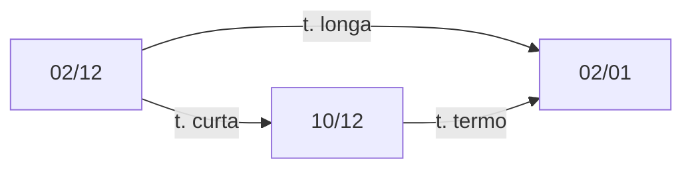

## O que é DI Futuro?

A expressão "DI Futuro" refere-se ao [contrato futuro](/enciclopedia/termos/c/contrato-futuro) da taxa média de depósitos interfinanceiros (taxa DI).

Esses contratos são [derivativos](/enciclopedia/termos/d/derivativos) que negociam a [taxa DI efetiva](/enciclopedia/termos/t/taxa-di) no período compreendido entra a compra do contrato e o seu vencimento.

## Contratos Futuros

Um contrato futuro é um contrato onde é previamente estabelecido:

-  A negociação de algum ativo em uma data futura; e
-  Por um preço predeterminado.

Por exemplo:

Se eu combinar com você comprar a sua casa daqui há um mês pagando R\$1.000.000,00, nós teremos estabelecido um contrato futuro.

O que pode ocorrer:

- A sua casa valorizar acima de R\$1.000.000,00 e você perder a valorização; ou
- A sua casa desvalorizar abaixo de R\$1.000.000,00 e eu pagar mais caro do que ela vale.

Assim, contratos futuros são úteis para fixar o preço de alguma coisa com antecedência, evitando ficar exposto às variações de preço do mercado.

## Futuro DI1

O contrato futuro de DI de um dia (DI1) negocia a taxa DI de um dia (taxa *over*) no período compreendido entre a compra e o vencimento do contrato. 

Por exemplo, ao comprar um contrato de DI1 com vencimento para o primeiro dia útil do mês seguinte a uma taxa de 4,50% ao ano, você estará "apostando" que a taxa DI efetiva (aquela que realmente foi apurada) no período entre a compra do contrato e o vencimento do mesmo, será igual a 4,50% ao ano.

Se a taxa efetiva do período for:

- **Abaixo de 4,50**: você devolverá a diferença;
- **Igual a 4,50**: você receberá rendimentos equivalentes à taxa combinada; e
- **Acima de 4,50**: você receberá a diferença.

### Funcionamento

Conforme as [instruções](http://www.b3.com.br/lumis/portal/file/fileDownload.jsp?fileId=8A828D2951C9C37701521D31E9CF661C) da B3, o preço do contrato (PU) é o valor presente de R\$100.000,00 considerando o prazo do contrato e os juros contratados, obtido com a seguinte fórmula:

$$

PU = {100.000 \over \Bigg ( 1+ \large {taxa \over 100}  \Bigg )^ {\Large du \over 252}}

$$

Fórmula 1 - Cálculo do PU de um futuro DI1.

Onde:

- **taxa**: taxa de DI do contrato; e
- **du**: número de dias úteis entre a data da operação (inclusive) e a data de vencimento (exclusive).

Assim, digamos que você tenha comprado um contrato com vencimento em 21 dias úteis a uma taxa de 4,50% a.a.. O PU será:

$$

PU = {100.000 \over \Bigg ( 1+ \large {4,50 \over 100}  \Bigg )^ {\Large 21 \over 252}} = 99.633,86

$$

Fórmula 2 - Cálculo do PU de um futuro DI1 considerando a taxa de 4,50% ao ano e 21 dias úteis para o vencimento.

### Ajustes

Devido às características de  [alavancagem](enciclopedia/termos/a/alavancagem) dos contratos futuros, o resultado de cada operação é apurado dia a dia.

Ao final de cada pregão, a Bolsa de Valores faz [uma média](http://www.b3.com.br/pt_br/market-data-e-indices/servicos-de-dados/market-data/historico/derivativos/ajustes-do-pregao/) das ofertas de compra e venda de contratos e estabelece um **PU de ajuste**  que será um PU de referência para que a posição dos investidores seja ajustada.

No caso do futuro DI1, o ajuste é feito de duas maneiras:

- **no dia da operação**: o ajuste será a diferença entre o PU de ajuste e o PU da operação; e
- **nos demais dias**: o ajuste será a diferença entre o PU de ajuste e o PU do dia anterior corrigido pela taxa DI efetiva.

O ajuste é feito debitando-se ou creditando-se o valor em reais na conta do investidor.

### Comprado e Vendido

É possíve comprar ou vender um contrato, a diferença dependerá do que você espera que irá acontecer:

- Se você acha que a taxa DI será maior ou igual à taxa contratada: você compra um contrato; e
- Se você acha que a taxa DI será menor ou igual à taxa contratada: você vende um contrato.

É comum no mercado financeiro utilizar-se as expressões **comprado** e **vendido**:

- **Comprado**: ganha com a alta do preço; e
- **Vendido**: ganha com a queda do preço.

Repare na fórmula 1 que, quanto maior for a taxa, menor será o PU e vice-versa.

Dessa forma diz-se que quem:

- **Comprou um contrato**: está comprado em taxa e vendido em PU; e
- **Vendeu um contrato**: está comprado em PU e vendido em taxa.

### Código

Os contratos futuros de DI1 são negociados com o código:

DI1XYY

Onde:

- **X**: é uma letra referente ao mês de vencimento conforme tabela 1 (o DI1 vence no primeiro dia útil do mês); e
- **YY**: é o ano de vencimento.

|Código|Mês|
|------|---|
|F|JAN|
|G|FEV|
|H|MAR|
|J|ABR|
|K|MAI|
|M|JUN|
|N|JUL|
|Q|AGO|
|U|SET|
|V|OUT|
|X|NOV|
|Z|DEZ|

Figura 1 - Códigos de vencimento dos contratos futuros da B3.

Assim, um contrato com o código DI1F21, indica o contrato futuro de taxa DI de 1 dia com vencimento no primeiro dia útil de de janeiro de 2021.

### Exemplo

Vamos detalhar o fluxo de um contrato futuro de DI1, com as seguintes premissas:

- Vencimento em 5 dias úteis;
- Taxa da compra = 4,50% a.a;
- Compra de 5 contratos (mínimo a ser operado); e
- Uma taxa DI efetiva de 4,60% em todos os dias.

**1. PU de compra**

O PU de compra será dado pela fórmula 1, resultando em:

$$

PU = {100.000 \over \Bigg ( 1+ \large {4,50 \over 100}  \Bigg )^ {\Large 4 \over 252}} = 99.930,15

$$

**2. Ajuste do dia de compra (t)**

Suponha que ao final do dia da compra, a Bolsa tenha reportado um PU de ajuste de R\$99.928,00 (o que equivale a uma taxa de 4,64% a.a. )

O ajuste do dia da compra será dado pela fórmula:

$$

A \small t = (PA \small t - PO) \times M \times N

$$

Fórmula 3 - Cálculo do Ajuste diário no dia da operação de um contrato futuro DI1.

Onde:

- **At**: Ajuste do dia t;
- **PAt**: Preço de ajuste do dia t;
- **PO**: Preço da operação;
- **M**: Valore em reais para cada ponto do PU (nos contratos de DI, cada ponto equivale a R\$1,00); e
- **N** : número de contratos.

Assim:

$$

A \small t = (99.928,00 - 99.930,15) \times 1 \times 5 = -10,78

$$

**Valores de ajuste negativos são creditados ao comprador do contrato (comprado em taxa) e debitados do vendedor do contrato (vendido em taxa)**.

**Valores de ajuste positivos são debitados do comprador do contrato (comprado em taxa) e creditados ao vendedor do contrato (vendido em taxa)**.

Ou seja, nesse dia, como estamos comprados em taxa, receberíamos R\$10,78 de ajuste.

**3. Ajuste do dia t+1**

Nos dias seguidos a compra, o cálculo do valor de ajuste muda para o seguinte:

$$

A \small t = [PA \small t - (PA {\scriptstyle t-1} \times FC \small t)] \times M \times N

$$

Fórmula 4 - Cálculo do Ajuste diário nos dias sucessivos à operação de um contrato futuro DI1.

**Nota:** Apesar de parecer complexa, essa fórmula apenas atualiza o PU de ajuste do dia anterior (PAt-1) pela taxa DI efetiva (FCt) e subtrai o resultado do PU de ajuste do dia (PAt). Em seguida, multiplica-se o resultado pelo valor dos pontos (R\$1,00 por ponto) e o número de contratos.

Onde:

- **At**: Ajuste do dia t;
- **PAt**: Preço de ajuste do dia t;
- **PAt-1**: Preço de ajuste do dia anterior;
- **M**: Valore em reais para cada ponto do PU (nos contratos de DI, cada ponto equivale a R\$1,00);
- **N** : número de contratos; e
- **FCt**: fator de correção dado pela taxa efetiva DI transformada para taxa diária (fórmula 3);

$$

FC \small t = {\Bigg ( 1+  {{DI {\scriptstyle t-1}} \over 100}  \Bigg )^ {\Large 1 \over 252}}

$$

Fórmula 5 - Cálculo do fator de correção.

Onde:

- **DIt-1**: taxa DI efetiva referente ao dia útil a anterior ao dia do ajuste;

Supondo que a taxa efetiva para todos os dias foi de 4,60%, e supondo que nesse dia o PU de ajuste tenha sido de R\$99.950,00 teremos:

$$

FC \small t = {\Bigg ( 1+  {{4,60} \over 100}  \Bigg )^ {\Large 1 \over 252}} = 1,000178

$$

e

$$

A \small t = [99.950,00 - (99.928,00 \times 1,000178)] \times 1 \times 5 = 20,82

$$

Assim, o ajuste para t+1 foi de R\$20,82, ou seja, foram debitados de nossa conta R\$20,82.

**4. Ajuste do dia t+2 até o vencimento**

O cálculo para os demais dias ocorre de forma semelhante ao item anterior, sendo que, no vencimento, o PU será de 100.000.

Supondo que a taxa DI efetiva para os demais dias manteve-se em 4,60% ao ano, o fluxo ficaria assim:

|DU|PU Ajuste*|Ajuste|
|--------------------|---------|------|
|5|99.928,00|-10,78|
|4|99.950,00|20,82|
|3|99.965,00|-14,19|
|2|99.982,00|-4,20|
|1|99.995,00|-24,22|
|0|100.000,00|-64,23|

*Valores Aleatórios

Figura 2 - Fluxo simulado dos ajustes de um contrato futuro de DI1.

Somando-se os ajustes, obtemos o total de **-R\$96,82**. Como sabemos, valores negativos são creditados ao comprador de contratos, ou seja, durante o período de validade dos contratos, recebemos R\$96,82 em ajustes.

**5. Resultado**

- Compramos nossos contratos a um PU de R\$99.930,15;
- No vencimento do contrato, recebemos R\$100.000,00 por cada contrato; e
- Recebemos, no total, R\$96,82 em ajustes, ou R\$19,36 por contrato.

Tivemos, portanto, um lucro por contrato de:

$$

Lucro = (100.000,00 - 99.930,15) + 19,36 = 89,21

$$

Nossa rentabilidade para 5 dias úteis foi de:

$$

Rent. = { 89,21 \over 99.930,15} = 0,08927\%

$$

Convertendo essa taxa para valores anuais obtemos:

$$

Taxa Anual = { \Bigg ( 1+  {{0,08927} \over 100}  \Bigg )^ {\Large 252 \over 5} -1 } = 4,60\%

$$

Ou seja, tivemos um rendimento de 4,60% ao ano no contrato, que foi a taxa efetiva do DI para o período do contrato. Como fizemos a compra por uma taxa de 4,50%, obtivemos um lucro de R\$19,36 por contrato devido a essa diferença positiva na taxa DI efetiva.

Caso estivéssemos em uma posição vendida em taxa, teríamos um prejuízo de R\$19,36 por contrato.

## Utilização

Os contratos futuros de taxa DI podem servir para especulação ou proteção ([*hedge*](enciclopedia/termos/h/hedge)).

Por exemplo, suponha que você:

- Tenha uma dívida cujos juros são corrigidos pela taxa DI;
- Imagina que a taxa DI aumentará no futuro, elevando suas despesas com juros; e
- Gostaria de travar seus juros em uma taxa prefixada, para evitar surpresas.

Você pode travar os juros que irá pagar na dívida utilizando os contratos futuros. Nesse caso, você compraria contratos futuros em uma quantidade adequada para compensar as perdas com juros.

- Com a taxa DI subindo, você ganhará dinheiro nos contratos e perderá dinheiro na dívida; e
- Com a taxa DI caindo, você perderá dinheiro nos contratos mas reduzirá seu gasto com a dívida.

Se a operação for bem feita, você saberá de antemão a taxa final que pagará de juros.

## Taxas Implícitas

Analisar os contratos futuros de taxa DI permite conhecer as **taxas implícitas**, isto é as taxas que os participantes do mercado estimam para o futuro.

Como a taxa DI1 é sempre muito próxima da [taxa SELIC](/aprenda/financas/economia/taxa-selic), analisar os contratos futuros de DI1 permite estimar qual o patamar de taxa SELIC é esperado para datas futuras.

Para fazer isso, é preciso utilizar as taxas dos diversos vencimentos disponíveis e algum método de interpolação para o cálculo de [taxa a termo](/enciclopedia/termos/t/taxa-a-termo), tal como o *flat forwards*, a [ETTJ](/enciclopedia/termos/e/ettj) ou o *cubic spline*.

### Cálculo da Taxa Implícita

No dia 02/12/2019, o contrato futuro de DI1 com vencimento em 02/01/2020 tinha as seguintes características:

|PU|DU para o vencimento|Taxa
|--|-----|--|
|99622,39|21|4,64%|

Figura 3 - Características do DI1F20 em 02/12/2019. Fonte: B3.

Sabendo que haverá uma reunião do COPOM no dia 10/12 e que a meta da taxa SELIC é de 5,00%, podemos utilizar o contrato futuro para estimar o que o mercado acha que ocorrerá na reunião do COPOM em relação à SELIC.

Utilizando o método de interpolação  *flat forwards* de acordo com a figura 4, podemos calcular a taxa esperada.

Figura 4 - Interpolação de taxas utilizando o método <em>flat forwards</em>.

Nesse caso, teremos:

- **taxa longa**: taxa do contrato futuro de 4,64%;
- **taxa curta**: meta da taxa SELIC de 5,00%; e
- **taxa a termo**: taxa implícita no contrato.

O cálculo é realizado de acordo com a fórmula 6: 

$$

\Bigg (1 + {TL \over 100} \Bigg) ^ {\Large dul \over 252} = \Bigg (1 + {TC \over 100} \Bigg ) ^ {\Large duc \over 252} \times \Bigg ( 1 + {TT \over 100} \Bigg ) ^ {\Large dut \over 252}

$$

Fórmula 6 - Cálculo de uma taxa a termo utilizando o método <em>flat forwards</em>.

Onde:

- **TL**: taxa longa;
- **dul**: dias úteis referentes à taxa longo;
- **TC**: taxa curta;
- **duc**: dias úteis referentes à taxa curta;
- **TT**: taxa a termo; e
- **duc**: dias úteis referentes à taxa a termo.

Fazendo as substituições necessárias na fórmula 6, chegamos ao seguinte resultado:

$$

\Bigg (1 + { 4,64 \over 100} \Bigg) ^ {\Large 21 \over 252} = \Bigg (1 + {5,00 \over 100} \Bigg ) ^ {\Large 6 \over 252} \times \Bigg ( 1 + {TT \over 100} \Bigg ) ^ {\Large 21 - 6 \over 252}

$$

Logo:

$$

TT = { \Bigg [ {{(1,0464)^{\Large 21 \over 252}} \over {(1,05)^{\Large 6 \over 252}}} \Bigg] ^ {\large 1 \over (21-6)} -1 } = 4,50\%

$$

Podemos concluir que o mercado espera uma queda de 0,50% na meta da taxa SELIC na próxima reunião do COPOM.