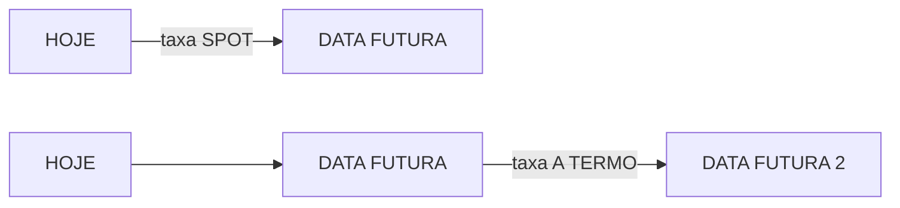
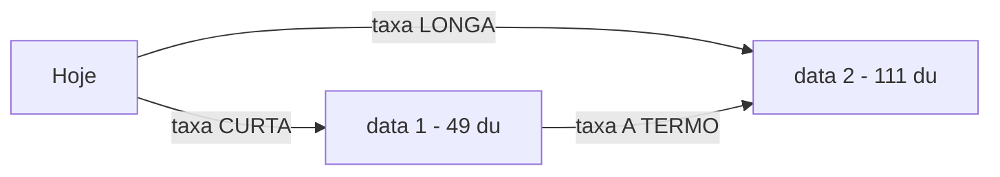
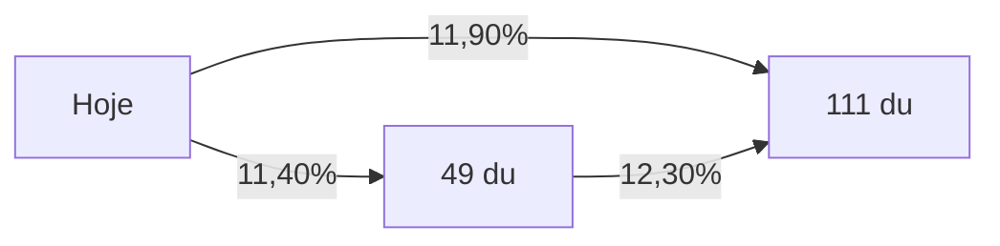

## O que é uma taxa a termo?

Uma taxa a termo de juros é uma taxa cujo ínicio do período de capitalização é uma data futura.

Figura 1 - Representação gráfica de uma taxa <em>spot</em> e uma taxa a termo.

Observe a figura 1.  Uma **taxa *spot*** é uma taxa cujo início da capitalização (início da contagem do prazo da taxa de juros) é o dia de hoje. Já a **taxa a termo** inicia a contagem em uma data futura.

## Utilização

Calcular a taxa a termo permite estimar a taxa de juros ímplicita em períodos para os quais não possuímos referência reais no mercado.

Por exemplo:

Considere dois títulos de renda fixa e o dia de hoje (D):

- **Título 1**: vencimento em D+30 e taxa de 10,00%;
- **Título 2**: vencimento em D+60 e taxa de 12,00%.

Nesse caso, conhecemos as taxas para os vértices (datas) D+30 e D+60. Mas e a taxa para o período compreendido entre D+30 e D+60?

Digamos que você tenha um título que vencerá em D+45, como saber a taxa de juros que o remunera?

Conhecendo duas ou mais taxas *spot* para períodos diferentes é possível estimar a taxa a termo compreendida entre os dois períodos através de métodos como o *flat forwards*, a [Estrutura a Termo da Taxa de Juros](/enciclopedia/termos/e/ettj) e o *cubic spline*.

### Exemplo de *Flat Forwards*

Considere a figura 2:

Figura 2 - Cálculo de uma taxa a termo a a partir de taxas conhecidas.

Considerando:

- **taxa longa**: 11,90% a.a.; e
- **taxa curta**: 11,40%

Podemos calcular a taxa a termo considerando algumas premissas:

- **Expectativas Racionais**: a taxa longa(TL) será formada pela composição da taxa curta (TC) com a taxa a termo(TT);

$$

(1+{TL \over 100})^{\Large dul \over 252} = {   {(1+{TC \over 100})^{\Large duc \over 252}}   \times {(1+{TT \over 100})^{\Large dut \over 252}}    }

$$

Fòrmula 1 - Relação entre as taxas.

- **Preferência pela liquidez**: caso o periodo da taxa a termo esteja contido na taxa longa e na taxa curta, a taxa será igual à taxa de menor prazo (taxa curta); e

- ***Flat Forwards***: A taxa a termo diária será constante entre dois vértices (datas) conhecidos. No nosse exemplo, significa que a taxa termo não se alterará entre a data 1 e a data 2.

Utilizando as premissas do *flat forwards* e a fórmula 1, podemos calcular a taxa a termo da figura 2:

$$

(1+{11,90 \over 100})^{\Large 111 \over 252} = {   {(1+{11,40 \over 100})^{\Large 49 \over 252}}   \times {(1+{TT \over 100})^{\Large 62 \over 252}}    }

$$

Logo:

$$

{(1+{TT \over 100})^{\Large 62 \over 252}}   = {  {(1+{11,90 \over 100})^{\Large 111 \over 252}} \over {(1+{11,40 \over 100})^{\Large 49 \over 252}}   }

$$

E:

$$

TT = 12,30\%

$$

Substituindo os valores na figura 2, temos:

Figura 3 - Exemplo  de cálculo de uma taxa a termo.

Ou seja, podemos entender que os investidores que negociam as taxas longas e curtas, estão considerando uma taxa de 12,30% para o período compreendido entre hoje+49 dias úteis e hoje+111 dias úteis.

### Estrutura a Termo de Taxa de Juros

Conhecendo duas ou mais taxas para períodos diferentes (vértices), podemos, através de um estudo estatístico de regressão, determinar uma função matemática que nos permita identificar valores de taxa contidos entre os vértices conhecidos.

A [Estrutura a Termo de Taxa de Juros (ETTJ)](/enciclopedia/termos/e/ettj) é essa função. Ela representa a variação esperada da taxa de juros entre um intervalo de tempo.

Para obter a ETTJ de alguma taxa, pode-se utilizar *softwares como o Excel*.

A [forma da ETTJ quando plotada](/aprenda/financas/economia/mercado-de-juros#estrutura-a-termo-de-taxa-juros-ettj) em um gráfico permite aos investidores analisar as expectativas do mercado para o futuro, além de auxiliar na obtenção de taxas para ativos com vencimento fora dos vértices conhecidos.