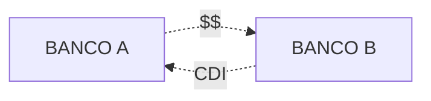

## O que é taxa DI?

Taxa Média de Depósitos Interfinancerios (taxa DI) é a taxa média dos juros cobrados nos empréstimos que os bancos fazem no mercado interbancário emitindo CDI.

Para saber como a taxa é calculada, de uma olhada na [metodologia oficial](http://www.b3.com.br/pt_br/market-data-e-indices/indices/indices-de-segmentos-e-setoriais/metodologia-do-di.htm).

### DI Over

Os empréstimos interbancários podem ter duração de um dia ou mais.

Quando a taxa é apurada apenas nos empréstimos com duração de um dia, chama-se a taxa de **DI *over*** (em referência ao termo *overnight*).

## O mercado Interbancário

Diariamente, os bancos devem manter uma certa quantidade de dinheiro junto ao Banco Central, chamada de [depósito compulsório](/aprenda/financas/economia/politica-monetaria#depósito-compulsório).

É comum que, devido às operações que realizaram durante o dia, alguns bancos terminem com menos dinheiro do que necessitam enquanto outros terminem com sobra de recursos.

Os bancos que tem sobrando emprestam dinheiro para os que estão precisando. Isso pode ser feito:

- Utilizando títulos públicos como garantia; ou
- Utilizando os [Certificados de Depósito Interbancário (CDI)](/enciclopedia/termos/c/cdi).

Os CDI são utilizados quando o banco não possui títulos públicos ou quando o empréstimo precisa seguir padrões diferentes dos especificados no [SELIC](/aprenda/financas/economia/taxa-selic).

Figura 1 - Estrutura de um empréstimo interbancário fora do SELIC.

## Taxa CDI e Taxa DI

É comum ver referências ao "rendimento do CDI", investimentos que seguem o CDI etc.

Na verdade, a refrência feita é aos valores da taxa DI.

## Utilização

A taxa DI é computada diariamente, porém, é divulgada em valores anuais.

Entre suas funções estão:

- Remunerar títulos de renda fixa;
- [*Benchmark*](/enciclopedia/termos/b/benchmark) para avaliaçao de performance; e
- É utilizada como referência de taixa livre de risco através do [DI futuro](/enciclopedia/termos/d/di-futuro).

## Taxa SELIC e Taxa DI

O **risco soberano**, isto é, o risco de o governo dar calote nas suas dívidas, é considerado menor do que o **risco privado** — risco das empresas e instituições privadas não pagarem suas dívidas. Assim, teoricamente, emprestar dinheiro ao governo deveria ser o o investimento com o menor rendimento, haja vista ter o menor risco.

Considerando-se a taxa SELIC (risco soberano) e a taxa DI (risco privado), era de se esperar que a taxa DI fosse maior que a taxa SELIC. No entanto, a taxa DI costuma ser **igual ou inferior à taxa SELIC**. 

Esse comportamento inesperado pode ser explicado por algumas razões como:

- Os bancos são remunerados pela taxa SELIC mas remuneram seus clientes pela taxa DI, havendo um interesse deles de manter o DI mais baixo;
- A metodologia de cálculo da taxa DI diz que, caso algumas condições não sejam atingidas, a taxa DI do dia será igual a taxa SELIC divulgada para o mesmo dia.

Assim, se compararmos ambas as taxas ao longo do tempo, veremos que elas tem uma tendência de manter-se igual ou com a taxa DI abaixo da taxa SELIC.

| Data   | Taxa DI Média | Taxa SELIC |
|--------|---------------|------------|
| jan-18 | 6,89          | 6,9        |
| fev-18 | 6,89          | 6,9        |
| mar-18 | 6,64          | 6,65       |
| abr-18 | 6,39          | 6,4        |
| mai-18 | 6,39          | 6,4        |
| jun-18 | 6,39          | 6,4        |
| jul-18 | 6,39          | 6,4        |
| ago-18 | 6,39          | 6,4        |
| set-18 | 6,39          | 6,4        |
| out-18 | 6,4           | 6,4        |
| nov-18 | 6,4           | 6,4        |
| dez-18 | 6,4           | 6,4        |

Figura 2 - Taxa DI Média e Taxa Selic no ano de 2018.

