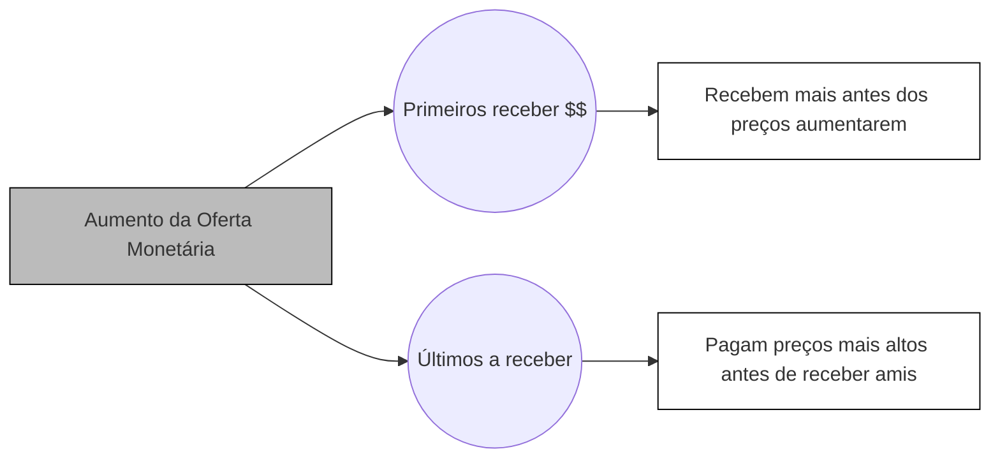

##O que é inflação?

A definição exata de inflação é assunto controverso entre economistas. 

Há aqueles que caracterizam a inflação como o **aumento contínuo e generalizado dos preços**. No entanto, há economistas que apontam que o aumento dos preços é uma consequência da inflação, que se caracterizaria pelo **aumento na quantidade de dinheiro existente** (oferta monetária) resultando em uma **perda do poder aquisitivo do dinheiro**.

##Por que existe inflação?

Economistas apontam que a inflação existe, basicamente, por três motivos:

- Demanda: quando a demanda por produtos e serviços aumenta porém a oferta permanece estagnada;
- Custos: Quando o preço de insumos na produção de bens e serviços aumenta e o custo maior é repassado; e
- Inercial: Quando as pessoas praticam aumento sistemático de preços para se resguardarem de uma inflação que elas acreditam que ocorrerá no futuro.

No entanto, para entender a inflação é preciso entender o que motiva esses três fatores.

###Aumento da Oferta Monetária

Na teoria econômica, diz-se que o preço é o resultado da oferta e demanda por um produto. Supondo uma oferta constante:

- Quanto maior a demanda, maior o preço que alguns estarão dispostos a pagar pelo produto e o preço tende a subir; e
- Quanto menor a demanda, menos as pessoas estarão dispostas a pagar pelo produto e há uma tendência de queda no preço.

O raciocínio é semelhante para a oferta. Supondo uma demanda constante:

- Quanto maior a oferta, menor será o preço que as pessoas estarão dispostas a pagar pelo produto e o preço tende a cair; e
- Quanto menor a oferta, mais raro o produto e maior o preço pelo qual as pessoas estarão dispostas a adquiri-lo, havendo uma tendência de aumento do preço.

Você pode se aprofundar neste assunto lendo o artigo sobre a [Lei da Oferta e da Procura](https://pt.wikipedia.org/wiki/Lei_da_oferta_e_da_procura) na Wikipedia.

**O dinheiro obedece as leis da oferta e da demanda como qualquer outro produto**.

Imagine que, do dia para a noite, a quantidade de dinheiro em poder de todas as pessoas dobrasse de tamanho. Quem tinha R\$100,00 passa a ter R\$200,00.

Com mais dinheiro em mãos, as pessoas passarão a querer comprar produtos mais caros aos quais não tinham acesso antes.

Isso gera um aumento na demanda por esses produtos sem que haja aumento na oferta. Conforme a lei da oferta e da demanda, o preço do produto irá subir até atingir um novo equilíbrio. Isso irá se repetir para todos os produtos.

Ou seja, o aumento na quantidade de dinheiro causará um aumento generalizado nos preços de forma que o poder aquisitivo das pessoas não se altera. Não há um aumento **real** do poder aquisitivo, apenas um aumento **nominal**.

Ter mais dinheiro só tem utilidade quando essa quantidade maior de dinheiro comanda a troca de mais bens e produtos ou de bens e produtos melhores. **Dinheiro não é riqueza**, ele é apenas um meio para se obter riqueza. Assim, **criar mais dinheiro não implica que houve aumento da riqueza**.

###Transferência de Riqueza

Acontece que, quando a oferta de dinheiro aumenta, esse dinheiro não é distribuído para todas as pessoas ao mesmo tempo e, consequentemente, o ajuste dos preços não atinge a todos de maneira uniforme.

Os primeiros a receberem o novo dinheiro terão acesso a bens e serviços com preços anteriores aos aumentos generalizados, tendo um aumento real em sua renda, enquanto os últimos a receberem o novo dinheiro serão prejudicados pelo aumento dos preços antes que o novo dinheiro chegue até eles.

Ocorre, então, uma transferência de riqueza dentro do sistema econômico, pois:

- Há um grupo que recebe mais dinheiro antes de ser atingido pelo aumento dos preços; e
- Há um grupo que é atingido pelo aumento dos preços antes de receber o novo dinheiro.

Quem são os primeiros da fila a receber o aumento da oferta monetária? 

São os governos e alguns poucos grupos com acesso a investimentos que os protegem do aumento dos preços.

Quem são os últimos da fila?

São aqueles que estão no fim da linha produtiva, como os trabalhadores assalariados e o mais pobres, que não têm acesso a investimentos capazes de lhes proteger do aumento dos preços.

###O Imposto Oculto

A fonte de receitas de um governo são os impostos que ele cobra da população.

Como governos estão sempre gastando mais do que arrecadam, eles estão sempre em busca de maneiras de obter mais dinheiro.

Isso pode ser feito através do aumento de impostos ou através de empréstimos.

O problema é que aumento de impostos, por vezes, são politicamente inviáveis.

O endividamento do governo também tem limites. A partir de certo ponto, ele não consegue mais encontrar alguém disposto a financiá-lo.

Como detém o monopólio sobre a criação de moeda, o governo pode simplesmente imprimir mais dinheiro para financiar as suas atividades.

Por ser o primeiro a fazer uso do novo dinheiro, o governo ganha um poder aquisitivo, podendo adquirir bens e serviços pelos preços não corrigidos pela nova oferta de dinheiro.

No entanto, imprimir dinheiro não é uma forma mágica de gerar riqueza e esses gastos superiores do governo, no final das contas, terão de ser pagos de alguma forma.

Como já vimos, quem acabará pagando serão os últimos a receberem o novo dinheiro, que terão seu poder de compra reduzido, ficando mais pobres.

Houve, assim, uma trasnferência de riqueza dessas pessoas para o governo, o que caracteriza um imposto.

A inflação acaba sendo um imposto pago pela população que vem disfarçado de outro nome.

<h4>Imprimindo dinheiro?</h4>

Na prática, o governo não precisa imprimir dinheiro diretamente para se financiar. Ele faz isso de maneira indireta através dos [bancos](/financas/economia/sistema-bancario).

Assim, quando precisa de dinheiro, o governo emite títulos de dívidas, que são comprados pelos bancos.

A partir daí, o governo já conseguiu o dinheiro que precisava para se financiar.

No entanto, os bancos só compram esses títulos, financiando o governo, porque sabem que poderão vendê-los para o Banco Central.

O Banco central compra os títulos dos bancos, aumentando o valor do [depósito compulsório](/financas/economia/politica-monetaria#depósito-compulsório) dos bancos em suas contas no Banco central.

Com valores maiores nas suas contas de compulsório, os Bancos podem injetar mais dinheiro através de empréstimos e investimentos.

A partir daí, o dinheiro criado se espalha pela economia gerando as consequências discutidas até aqui.

A impressão de dinheiro não ocorreu literalmente, mas sim de forma indireta, através da **criação de crédito**.

O crédito atua da mesma forma que o dinheiro, servindo como um meio de troca para a obtenção de bens e serviços.

Como sabemos que mais dinheiro em circulação sem que haja aumento da oferta de bens e serviços exerce pressão sobre os preços, o aumento de crédito atua exatamente da mesma maneira e o resultado é semelhante ao que ocorreria se o o governo simplesmente tivesse ligado as prensas da casa da moeda e impresso mais dinheiro.

Como o governo foi o primeiro a conseguir o crédito, ele também será o primeiro a utilizar esse "dinheiro novo", não sendo atingido pelo aumento dos preços.

Como todo o dinheiro que o governo pega emprestado um dia terá de ser pago com impostos, quanto mais dinheiro o governo pegar emprestado, mais riqueza terá de ser transferida da sociedade para o Estado de forma que ele possa honrar as próprias dívidas.

##Intervenção Estatal

Os argumentos a favor da inflação defendem que, à medida que o nível de produção de bens e serviços aumenta, é necessário injetar mais dinheiro no sistema financeiro para **evitar que haja uma falta de dinheiro** (falta de liquidez) que possa acabar gerando **estagnação econômica** ou **deflação** (redução generalizada de preços). Estagnação ou deflação seriam responsáveis por males como queda na produção e desemprego.

No entanto, todos os economistas costumam reconhecer que a inflação tem também efeitos nocivos, diferindo em opinião somente sobre a quantidade. Os defensores da inflação apontam que ela é nociva somente quando em excesso e que, portanto, deve-se mantê-la sob controle sem extingui-la.

A teoria por trás da atual organização do sistema financeiro defende que é preciso encontrar um ponto de equilíbrio entre:

- O aumento da oferta monetária que evite a estagnação; e
- O aumento excessivo que possa causar uma inflação fora de controle.

O responsável por fazer a economia atingir esse ponto de equilíbrio seria o governo. 

Essa teoria é um dos pilares para justificar a centralização do sistema financeiro nas mãos do Estado.

Com esses pontos em mente, o Estado controlaria a quantidade de moeda de forma a suprir a necessidade de liquidez e evitar um excesso de inflação.

Daí surge a legislação atual, onde o Estado, através do Banco Central, exerce sua [política monetária](/financas/economia/politica-monetaria) (que é a política que controla a quantidade de dinheiro em circulação na economia) através de **metas para a inflação**.

##Como medir a inflação?

Como vimos, pode-se analisar a inflação tanto pelo lado do aumento da oferta monetária, quanto pelos seus efeitos nos preços.

###Variação nos Preços

A teoria econômica em que se baseiam as legislações atuais defende o foco apenas no controle da variação dos preços, sendo essa a política econômica exercida pelo governo.

Como forma de se proteger da inflação, o mercado financeiro também utiliza a apuração da variação dos preços, utilizando-na para corrigir o valor de contratos, empréstimos e investimentos, defendendo o poder de compra do dinheiro aplicado.

Para fazer essa análise, utilizam-se os [índices de preço](/financas/economia/indice-de-precos).

O critérios de cada índice variam, mas de maneira geral, eles funcionam da seguinte maneira:

- Define-se qual setor da economia deseja-se avaliar;
- Selecionam-se os bens, serviços e regiões que acredita-se representar melhor tal setor;
- Atribui-se um peso de participação para cada fator dentro do índice;
- Efetua-se a medição periódica dos preços; e
- A diferença apurada será a variação do índice para o período.

Os índices costuma ter avaliação mensal e são expressos em taxas percentuais. 

O Governo Brasileiro definiu que o índice oficial para se avaliar a inflação do país seria o [Índice Nacional de Preços ao Consumidor Amplo (IPCA)](/financas/economia/indice-de-precos#IPCA), passando esse a ser o índice utilizado para balizar as políticas econômicas.

A medição através de índices apresenta algumas desvantagens:

- Reflete a variação apenas de determinado setor da economia ou da população; e
- Pode ser manipulado através dos pesos definidos para cada preço dentro do índice.

Assim, além do IPCA, existem outros índices de inflação criados para serem utilizados em áreas da economia cuja variação de preço acredita-se que o IPCA não reflita adequadamente.

###Oferta Monetária

Medir quantidades de dinheiro em uma economia é mais difícil do que parece.

Por exemplo, digamos que, inicialmente, havia R\$1.000,00 em circulação. Em seguida:

- Parte do dinheiro é depositado em uma conta corrente;
- Parte é utilizado para investir em CDB;
- Parte é utilizado na aquisição de uma ação; e
- Parte é guardada embaixo do colchão.

Poderíamos dizer que o valor que sobrasse seria o equivalente ao dinheiro em circulação. No entanto, o CDB e ação podem ser utilizados em uma troca tal qual o dinheiro. O valor disponível em conta corrente pode ser emprestado pelo banco, gerando um crédito que passará a ser utilizado da mesma forma que o dinheiro.

Ou seja, medir apenas a quantidade de papel moeda em circulação não necessariamente irá refletir a realidade total dos valores que estão sendo movimentados e que exercem a função de moeda (meio de troca).

Dependendo de qual conceito de moeda deseja-se utilizar, acaba-se chegando a valores diferentes de moeda total em circulaço (oferta monetária). Na prática, utilizam-se diferentes conceitos de moeda padronizados, chamados de **agregados monetários** ou **meios de pagamento**, que são conhecidos pelas siglas M, M1, M2, M3 e M4.

No Brasil, o critério utilizado está relacionado ao tipo de instituição emissora. Em outros paises, utiliza-se o critério de liquidez.

Esses valores são divulgados pelo Banco Central periodicamente e podem ser vistos através do [sistema gerador de séries temporais](https://www3.bcb.gov.br/sgspub/localizarseries/localizarSeries.do?method=prepararTelaLocalizarSeries).

####Base Monetária (M)

A base monetária é a medida da quantidade de dinheiro mais básica. Consiste-se na:

- Quantidade de papel moeda emitido; e
- Reservas bancárias disponíveis no Banco Central (depósitos compulsórios).

É chamada de M ou M0.

Podemos dizer que M0 é o dinheiro que existe de fato.

####M1

A partir das suas reservas disponíveis no Banco Central, os [bancos](/financas/economia/sistema-bancario) são capazes de multiplicar a moeda através de crédito e investimentos.

Esse dinheiro criado pelos bancos não existe realmente, é apenas um número de computador e, por isso, é chamada de moeda escritural.

O conceito de M1 considera apenas a moeda em circulação que tem liquidez total e não gera rendimentos.

M1 = Moeda em poder do público (papel moeda e moeda metálica emitida) + depósitos à vista dos bancos comerciais (dinheiro em conta corrente)

A capacidade dos bancos de multiplicar a base monetária é dada por uma variável chamada de **multiplicador bancário (k)** e é inversamente proporcional ao requerimento de depósito compulsório (R) exigido pelo Banco Central.

$$
k = {1 \above{1pt} R}
$$

Assim, suponha que o depósito compulsório seja de 20%. Isso significa que o banco deve ter em suas reservas no Banco Central 20% de todo o valor que ele colocou em circulação em um dia.

Dessa forma, se um banco possui R\$100,00 em suas reservas, poderá ter colocado em circulação até R\$500,00. Ou seja, o banco pode multiplicar em até 5 vezes a quantidade total de moeda, pois o multiplicador bancário é igual a 5:

$$
k = {1 \above{1pt} 0,2} = 5
$$

Assim, em um [sistema de reservas fracionárias](financas/economia/sistema-bancario), onde os bancos tem capacidade de multiplicar a base monetária (M), a moeda em circulação (M1) será maior do que a moeda realmente existente (M).

No critério de divisão por emissores utilizados no Brasil, diz-se que o M1 é a moeda que tem origem nas insittuições monetárias (que são capazes de criar moeda).

####M2

O M2 é obtido somando-se aos valores de M1 os valores dos:

- Depósitos remunerados (poupança); e
- Depósitos a prazo e títulos (CDB, RDB, LCI, LH etc.); 

No critério de divisão por emissores utilizados no Brasil, diz-se que o M2 é a moeda que tem origem no sistema financeiro e suas instituições.

####M3

O M3 é obtido somando-se aos valores de M3 os valores dos:

- Cotas de fundos de renda fixa; e
- Operações compromissadas com títulos Federais.

No critério de divisão por emissores utilizados no Brasil, diz-se que o M3 agrega todas as captações do sistema financeiro.

####M4

O M4 é obtido somando-se aos valores de M3 os valores dos:

- Títulos públicos (federais, municipais, etc.).

No critério de divisão por emissores utilizados no Brasil, diz-se que o M4 inclui também o sistema emissor representado pelo governo.

 

**Referências**:

FORTUNA, Eduardo. <strong>Mercado Financeiro: produtos e serviço</strong>. 18 ed. Rio de Janeiro. Qualitymark, 2010.

