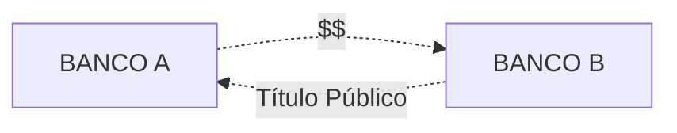
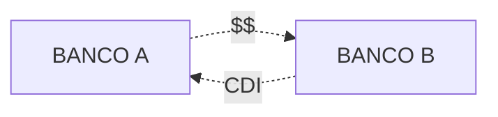

##O que é o mercado interbancário?

Durante um dia, acontece um grande fluxo de dinheiro em um banco.

O dinheiro pode sair das contas do banco na forma de empréstimos, investimentos, pagamentos e transferências e entrar como depósitos, transferências etc.

Em um sistema de [reservas fracionárias](/financas/economia/sistema-bancario#o-sistema-de-reservas-fracionárias), como é o sistema bancário brasileiro, os bancos mantém em sua posse apenas uma fração do dinheiro total que movimentam.

Isso gera uma situação em que os bancos ficam alavancados, isto é, devem mais do que realmente possuem.

O Banco Central do Brasil (BACEN) é quem determina quanto cada banco deve manter guardado. Esse dinheiro deve ficar depositado em uma conta que o banco tem no Banco Central, e é chamado de **depósito compulsório**.

A quantidade prevista de depósito compulsório que um banco deve possuir é calculada ao final do dia, contabilizando-se todas as operações que o banco fez ao longo do dia.

É comum que alguns bancos se encontrem em situação onde:

- Estão com valores menores do que o previsto nas suas contas no BACEN; ou
- Estão com valores acima do previsto nas suas contas no BACEN.

Para evitar ter de pegar dinheiro emprestado com o governo (que cobra juros altos) ou ficar com dinheiro sobrando sem rendimento, bancos que possuem reservas em excesso emprestam dinheiro para os bancos que precisam de dinheiro.

Por lei, esse empréstimo deve ser pago no dia seguinte. Assim, o banco fica com o dinheiro emprestado apenas de um dia para o outro, o que caracteriza a denominação ***overnight*** - que traduzido do inglês seria algo como "durante a noite" - dada a esse tipo de empréstimo.

Esse ambiente de negociação entre bancos é chamado de **mercado interbancário**.

##Sistema Especial de Liquidação e Custódia (SELIC)

Parte dos empréstimos realizados pelos bancos no mercado interbancário se dá utilizando titulos de dívida pública como garantia.

Esses empréstimos são registrados em um sistema eletrônico chamado Sistema Especial de Liquidação e Custódia (SELIC).

A taxa média dos empréstimos realizados no SELIC é a chamada [taxa SELIC](/financas/economia/taxa-selic).

A esse ambiente de negociaçao de títulos públicos entre as instituições financeiras se dá o nome de ***open market***.

##Certificado de Depósito Interbancário (CDI)

###O que é o Certificado de Depósito Interbancário?

Por vezes, os bancos precisando de dinheiro podem não ter a sua disposíção títulos públicos para oferecer como garantia, ou podem precisar realizar o empréstimo por mais de um dia.

Nesse caso, o banco emite um título, chamado de Certificado de Depósito Interbancário, onde especifica as características do empréstimo.

Na realidade, um banco que empresta dinheiro a outro banco comprará um CDI.

Os CDI também são chamados de **depósitos interfinanceiros (DI)**.

###O que é a taxa DI?

A taxa média dos juros cobrados nos empréstimos que os bancos fazem no mercado interbancário emitindo CDIs é chamada de **taxa DI**, ou **taxa de depósitos interfinanceiros**.

Esses empréstimos podem ter duração de um dia ou mais. Quando refere-se somente aos empréstimos com duração de um dia, chama-se a taxa de *DI over* (em referência ao termo *overnight*).

Para saber como a taxa é calculada, de uma olhada na [metodologia](http://www.b3.com.br/pt_br/market-data-e-indices/indices/indices-de-segmentos-e-setoriais/metodologia-do-di.htm).

###O que é a taxa CDI?

É apenas um outro nome para a taxa DI.

###Para que serve a taxa DI?

A grande maioria dos bancos costuma oferecer investimentos de renda fixa que são remunerados pela taxa DI.

Assim, é um índice de referência para investimentos de renda fixa.

###Qual o rendimento do CDI?

A taxa DI é calculada fazendo-se uma média de todos os empréstimos realizados em um dia no sistema interbancário. Normalmente ela é divulgada em valores anuais, fazendo-se a conversão de taxas.

A instituição que realiza o cálculo do DI e divulga ao mercado é a B3. Você pode conhecer o valor do DI/CDI acessando o [*site*](http://www.b3.com.br/pt_br/market-data-e-indices/indices/indices-de-segmentos-e-setoriais/serie-historica-do-di.htm) da B3. 

##CDI e SELIC

O **risco soberano**, isto é, o risco de o governo dar calote nas suas dívidas, é considerado menor do que o **risco privado** - risco das empresas e instituições privadas não pagarem suas dívidas. Assim, teoricamente, emprestar dinheiro ao governo deveria ser o o investimento com o menor rendimento, haja vista ter o menor risco.

Considerando-se a taxa SELIC (risco soberano) e a taxa DI (risco privado), era de se esperar que a taxa DI fosse maior que a taxa SELIC. No entanto, a taxa DI costuma ser **igual ou inferior à taxa SELIC**. Algumas razões para isso podem ser:

- Os bancos são remunerados pela taxa SELIC mas remuneram seus clientes pela taxa DI, havendo um interesse deles de manter o DI mais baixo;
- A metodologia de cálculo da taxa DI diz que, caso algumas condições não sejam atingidas, a taxa DI do dia será igual a taxa SELIC divulgada para o mesmo dia.

Assim, se compararmos ambas as taxas ao longo do tempo, veremos que elas tem uma tendência de manter-se igual ou com a taxa DI acima da taxa SELIC.

| Data       | Taxa DI Média | Taxa SELIC |
|------------|---------------|------------|
| 02/01/2019 | 6,4           | 6,4        |
| 03/01/2019 | 6,4           | 6,4        |
| 04/01/2019 | 6,4           | 6,4        |
| 07/01/2019 | 6,4           | 6,4        |
| 08/01/2019 | 6,4           | 6,4        |
| 09/01/2019 | 6,4           | 6,4        |
| 10/01/2019 | 6,4           | 6,4        |
| 11/01/2019 | 6,4           | 6,4        |
| 14/01/2019 | 6,4           | 6,4        |
| 15/01/2019 | 6,4           | 6,4        |
| 16/01/2019 | 6,4           | 6,4        |
| 17/01/2019 | 6,4           | 6,4        |
| 18/01/2019 | 6,4           | 6,4        |
| 21/01/2019 | 6,4           | 6,4        |
| 22/01/2019 | 6,4           | 6,4        |
| 23/01/2019 | 6,4           | 6,4        |
| 24/01/2019 | 6,4           | 6,4        |
| 25/01/2019 | 6,4           | 6,4        |
| 28/01/2019 | 6,4           | 6,4        |
| 29/01/2019 | 6,4           | 6,4        |
| 30/01/2019 | 6,4           | 6,4        |
| 31/01/2019 | 6,4           | 6,4        |

