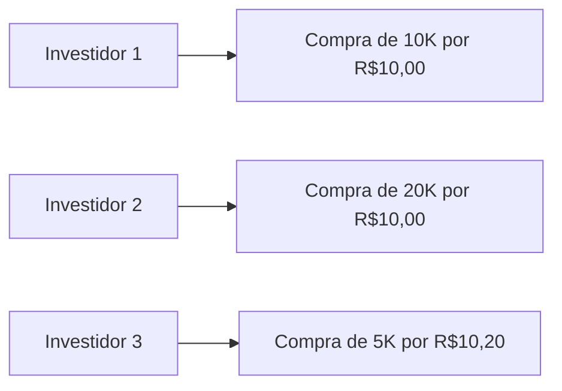

##O que é o livro de ofertas?

O livro de Ofertas, também chamado de ***book*** é a janela do *homebroker* que mostra todas as ordens de compra e venda registradas no sistema da Bolsa.

##Como funciona?

No sistema da Bolsa, toda vez que alguém envia uma ordem de compra ou de venda, deve especificar um preço e uma quantidade. Essas ordens ficam registradas no sistema e são mostradas no *homebroker* de forma semelhante à figura 1 abaixo:

<table style="border: 1px solid black; width:60%; margin:50px auto;" id="figura1">
<thead style="border: 1px solid black; text-align:center;">
<tr>
<td colspan="4" style="border: 1px solid black;text-align:center;padding:0.3rem;">Livro de Ofertas</td>
</tr>
<tr>
<td colspan="2" style="border: 1px solid black;text-align:center;padding:0.3rem;">Compra</td>
<td colspan="2" style="border: 1px solid black;text-align:center;padding:0.3rem;">Venda</td>
</tr>
</thead>
<tbody style="border: 1px solid black; text-align:center;">
<tr>
<td style="border: 1px solid black; text-align:center;padding:0.3rem;">Preço</td>
<td style="border: 1px solid black; text-align:center;padding:0.3rem;">Qtd</td>
<td style="border: 1px solid black; text-align:center;padding:0.3rem;">Qtd</td>
<td style="border: 1px solid black; text-align:center;padding:0.3rem;">Preço</td>

</tr>
<tr>
<td style="border: 1px solid black;text-align:center;padding:0.3rem;">R$10,00</td>
<td style="border: 1px solid black;text-align:center;padding:0.3rem;">1K</td>
<td style="border: 1px solid black;text-align:center;padding:0.3rem;">2K</td>
<td style="border: 1px solid black;text-align:center;padding:0.3rem;">R$10,05</td>

</tr>
<tr>
<td style="border: 1px solid black;text-align:center;padding:0.3rem;">R$9,99</td>
<td style="border: 1px solid black;text-align:center;padding:0.3rem;">1,5K</td>
<td style="border: 1px solid black;text-align:center;padding:0.3rem;">1K</td>
<td style="border: 1px solid black;text-align:center;padding:0.3rem;">R$10,06</td>

</tr>
<tr>
<td style="border: 1px solid black;text-align:center;padding:0.3rem;">R$9,97</td>
<td style="border: 1px solid black;text-align:center;padding:0.3rem;">5K</td>
<td style="border: 1px solid black;text-align:center;padding:0.3rem;">500</td>
<td style="border: 1px solid black;text-align:center;padding:0.3rem;">R$10,08</td>

</tr>
</tbody>
</table>

Figura 1 - Livro de Ofertas

Observe que há uma diferença de R\$0,05 no preço entre a melhor oferta de compra (R\$10,00) e a melhor oferta de venda (R\$10,05). Essa diferença é chamada de ***spread***.

As ordens são mostradas de acordo com sua prioridade de execução: **ordens mais acima tem prioridade sobre as demais**.

A prioridade das ordens é estipulada de acordo com alguns critérios, entre os quais, os mais importantes são:

- Hora do envio; e
- Preço.

###Prioridade

Suponha um livro de ofertas que ainda não possui nenhuma oferta registrada (figura 2)

<table style="border: 1px solid black; width:60%; margin:50px auto;">
<thead style="border: 1px solid black; text-align:center;">
<tr>
<td colspan="4" style="border: 1px solid black;text-align:center;padding:0.3rem;">Livro de Ofertas</td>
</tr>
<tr>
<td colspan="2" style="border: 1px solid black;text-align:center;padding:0.3rem;">Compra</td>
<td colspan="2" style="border: 1px solid black;text-align:center;padding:0.3rem;">Venda</td>
</tr>
</thead>
<tbody style="border: 1px solid black; text-align:center;">
<tr>
<td style="border: 1px solid black; text-align:center;padding:0.3rem;">Preço</td>
<td style="border: 1px solid black; text-align:center;padding:0.3rem;">Qtd</td>
<td style="border: 1px solid black; text-align:center;padding:0.3rem;">Qtd</td>
<td style="border: 1px solid black; text-align:center;padding:0.3rem;">Preço</td>

</tr>
<tr>
<td style="border: 1px solid black;text-align:center;padding:0.3rem;">-</td>
<td style="border: 1px solid black;text-align:center;padding:0.3rem;">-</td>
<td style="border: 1px solid black;text-align:center;padding:0.3rem;">-</td>
<td style="border: 1px solid black;text-align:center;padding:0.3rem;">-</td>

</tr>

</tbody>
</table>

Figura 2 - Livro de Ofertas em branco

Em seguida, três investidores enviam ordens de compra do ativo na seguinte ordem:

**OBS: 1K significa 1000 ativos. Assim, 10k são 10.000 ativos.**

Tanto o investidor 1 quanto o investidor 2 enviaram ordens de compra pelo mesmo preço. Como o investidor 1 enviou a ordem primeiro, sua ordem ganha prioridade (figura 3):

<table style="border: 1px solid black; width:60%; margin:50px auto;">
<thead style="border: 1px solid black; text-align:center;">
<tr>
<td colspan="4" style="border: 1px solid black;text-align:center;padding:0.3rem;">Livro de Ofertas</td>
</tr>
<tr>
<td colspan="2" style="border: 1px solid black;text-align:center;padding:0.3rem;">Compra</td>
<td colspan="2" style="border: 1px solid black;text-align:center;padding:0.3rem;">Venda</td>
</tr>
</thead>
<tbody style="border: 1px solid black; text-align:center;">
<tr>
<td style="border: 1px solid black; text-align:center;padding:0.3rem;">Preço</td>
<td style="border: 1px solid black; text-align:center;padding:0.3rem;">Qtd</td>
<td style="border: 1px solid black; text-align:center;padding:0.3rem;">Qtd</td>
<td style="border: 1px solid black; text-align:center;padding:0.3rem;">Preço</td>
</tr>

<tr>
<td style="border: 1px solid black;text-align:center;padding:0.3rem;">R$10,00</td>
<td style="border: 1px solid black;text-align:center;padding:0.3rem;">10K</td>
<td style="border: 1px solid black;text-align:center;padding:0.3rem;">-</td>
<td style="border: 1px solid black;text-align:center;padding:0.3rem;">-</td>
</tr>

<tr>
<td style="border: 1px solid black;text-align:center;padding:0.3rem;">R$10,00</td>
<td style="border: 1px solid black;text-align:center;padding:0.3rem;">20K</td>
<td style="border: 1px solid black;text-align:center;padding:0.3rem;">-</td>
<td style="border: 1px solid black;text-align:center;padding:0.3rem;">-</td>
</tr>

</tbody>
</table>

Figura 3 - Prioridade por ordem de envio

O investidor 3, apesar de ter sido o último a enviar a ordem, enviou uma ordem com uma melhor oferta de preço de compra. Sua ordem, então, ganha prioridade sobre as demais já registradas no sistema (figura 4):

<table style="border: 1px solid black; width:60%; margin:50px auto;">
<thead style="border: 1px solid black; text-align:center;">
<tr>
<td colspan="4" style="border: 1px solid black;text-align:center;padding:0.3rem;">Livro de Ofertas</td>
</tr>
<tr>
<td colspan="2" style="border: 1px solid black;text-align:center;padding:0.3rem;">Compra</td>
<td colspan="2" style="border: 1px solid black;text-align:center;padding:0.3rem;">Venda</td>
</tr>
</thead>
<tbody style="border: 1px solid black; text-align:center;">
<tr>
<td style="border: 1px solid black; text-align:center;padding:0.3rem;">Preço</td>
<td style="border: 1px solid black; text-align:center;padding:0.3rem;">Qtd</td>
<td style="border: 1px solid black; text-align:center;padding:0.3rem;">Qtd</td>
<td style="border: 1px solid black; text-align:center;padding:0.3rem;">Preço</td>
</tr>

<tr>
<td style="border: 1px solid black;text-align:center;padding:0.3rem;">R$10,20</td>
<td style="border: 1px solid black;text-align:center;padding:0.3rem;">5K</td>
<td style="border: 1px solid black;text-align:center;padding:0.3rem;">-</td>
<td style="border: 1px solid black;text-align:center;padding:0.3rem;">-</td>
</tr>

<tr>
<td style="border: 1px solid black;text-align:center;padding:0.3rem;">R$10,00</td>
<td style="border: 1px solid black;text-align:center;padding:0.3rem;">10K</td>
<td style="border: 1px solid black;text-align:center;padding:0.3rem;">-</td>
<td style="border: 1px solid black;text-align:center;padding:0.3rem;">-</td>
</tr>

<tr>
<td style="border: 1px solid black;text-align:center;padding:0.3rem;">R$10,00</td>
<td style="border: 1px solid black;text-align:center;padding:0.3rem;">20K</td>
<td style="border: 1px solid black;text-align:center;padding:0.3rem;">-</td>
<td style="border: 1px solid black;text-align:center;padding:0.3rem;">-</td>
</tr>

</tbody>
</table>

Figura 4 - Prioridade da melhor oferta

###Negócio Fechado

Supondo o livro de ofertas da [figura 1](#figura1), para que um negócio ocorra é preciso que:

- Surja alguém disposto a comprar por R\$10,05; ou
- Surja alguém disposto a vender a R\$10,00.

Quando ocorre o casamento das ordens enviadas, ocorre um negócio por aquele preço, o qual então aparece no *homebroker* como 

##Ordens ocultas

Nem todas as ordens aparecerão no livro de ofertas. Podem haver ordens automatizadas programadas para serem enviadas apenas se determinados pré-requisitos forem atendidos.

Por exemplo, um investidor institucional que queira fazer a venda de grandes quantidades de um mesmo ativo, irá enviar várias ordens com pequenas quantidades do ativo como forma de tentar evitar que o preço do ativo caia devido ao volume elevado que ele mesmo está vendendo. Nesse caso, ficará registrada no livro apenas a primeira da série de ordens, sendo as demais enviadas à medida que as anteriores são executadas.